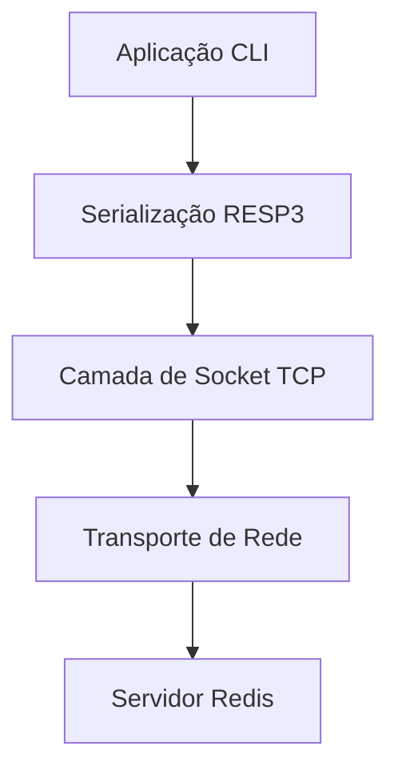

# 🔴 Implementação de CLI Redis em C

<p align="center">
<strong>Interface de Linha de Comando para Banco de Dados Redis com Conexão TCP Nativa</strong>
<br>
<em>Maio de 2025</em>
</p>

## 🏗️ Visão Geral da Arquitetura

O CLI Redis implementa uma arquitetura de rede em camadas usando sockets TCP nativos e protocolo RESP3 para comunicação eficiente com Redis.



## 📡 Comunicação de Rede

### 🔌 Pilha de Protocolos
| Camada | Protocolo | Finalidade |
| :--- | :--- | :--- |
| **Transporte (L4)** | TCP | Conexão confiável com handshake de 3 vias |
| **Aplicação (L7)** | RESP3 | Serialização de dados e processamento de comandos |

### 🤝 Processo de Handshake
1. **Handshake TCP** (Camada 4): Estabelece canal confiável orientado a conexão
2. **Handshake Redis** (Camada 7): Negociação de protocolo, autenticação e seleção de banco de dados

## ⚙️ Implementação Técnica

### 🔧 Gerenciamento de Sockets
- **Sockets POSIX** para endpoints de comunicação de rede
- Capacidades de rede TCP/IP nativas
- Pool de conexões e gerenciamento

### 📦 Manipulação do Protocolo RESP3
| Função | Descrição |
| :--- | :--- |
| **Serialização** | Comandos → strings formatadas em RESP3 |
| **Desserialização** | Respostas RESP3 → estruturas de dados utilizáveis |
| **Suporte a Tipos** | Strings, erros, inteiros, bulk strings, arrays |

## ✨ Funcionalidades Principais

- ✅ **Execução interativa de comandos**
- ✅ **Gerenciamento de conexão TCP nativa**  
- ✅ **Implementação completa do protocolo RESP3**
- ✅ **Tratamento abrangente de erros**
- ✅ **Suporte a todos os comandos Redis**
- ✅ **Serialização/desserialização eficiente de dados**

## 🚀 Como Usar

```bash
# Compilar o projeto
$ make clean && make all

# Conectar ao servidor Redis
$ ./out/redis-cli -h <HOST_REDIS> -p <PORTA_REDIS>

# Exemplo com valores padrão
$ ./out/redis-cli -h 127.0.0.1 -p 6379
```

## 🛠️ Instruções de Build

```bash
# Clonar e compilar
git clone <repositório>
cd redis-cli
make all

# Limpar artefatos de build
make clean
```

---

**⭐ Implementação em C nativa** proporcionando interações de baixa latência com banco de dados Redis com suporte completo ao protocolo e comunicação de rede eficiente.
